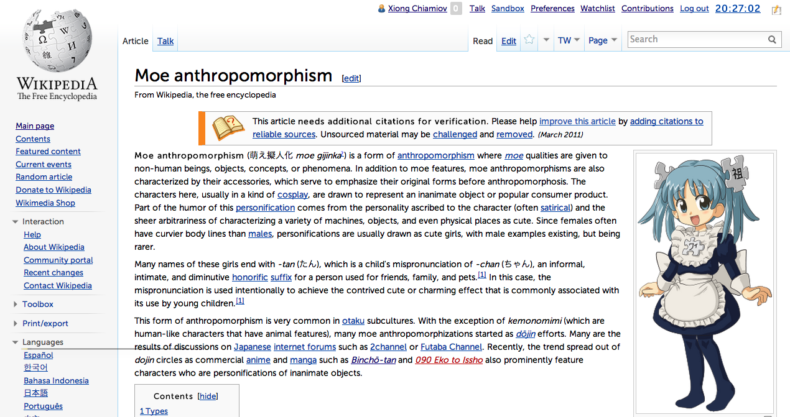
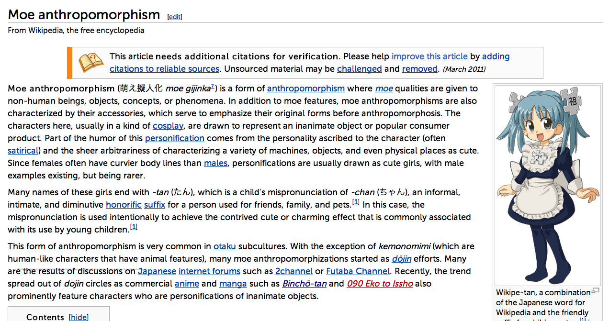

A rebirth of the Wikimedia Chick skin.

In April of 2013, Wikimedia [removed several skins], including Chick, a
no-nonsense content-focused skin.  Every one of the currently-supported skins
has a sidebar filled with cruft, as well as lots of stuff on the top as well.

I like to read without all those distractions, which is why I was using Chick
in the first place.  So, I decided to make a set of user styles to replicate
Chick as a modification of Vector.

All of the base work [was done] by [MZMcBride].  His time is greatly
appreciated, and without it, I'd have never gotten started on this.

A note on naming: [the phoenix] is a mythical bird associated with rebirth.
-tan is [an honorific suffix] used in Japan to refer to a cute, babyish
character.  Fenikkusu-tan, then, is Chick reborn.

# Installation

Copy and paste `fenikkusu-tan.css` into your `vector.css`.  For instance, on
the English Wikipedia, my `vector.css` is located at
http://en.wikipedia.org/wiki/User:Xiong_Chiamiov/vector.css .

If you're having difficulties finding this, go to [your preferences] and click
on the "Custom CSS" link.

# License

Available under the [Creative Commons Attribution-ShareAlike license][by-sa].

[removed several skins]: https://meta.wikimedia.org/wiki/Turning_off_outdated_skins
[was done]: https://meta.wikimedia.org/wiki/Tech/Archives/2013#Move_sidebar_links_to_bottom_.28similar_to_MySkin.29
[MZMcBride]: https://meta.wikimedia.org/wiki/User:MZMcBride
[the phoenix]: http://en.wikipedia.org/wiki/Phoenix_(mythology)
[an honorific suffix]: http://en.wikipedia.org/wiki/Japanese_honorifics
[your preferences]: http://en.wikipedia.org/wiki/Special:Preferences#mw-prefsection-rendering
[by-sa]: https://creativecommons.org/licenses/by-sa/3.0/

